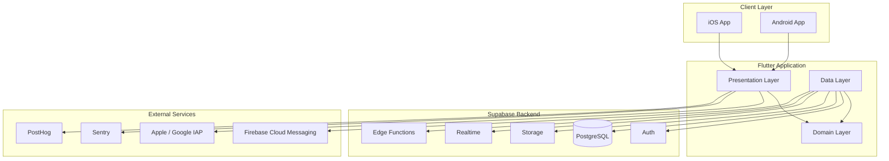
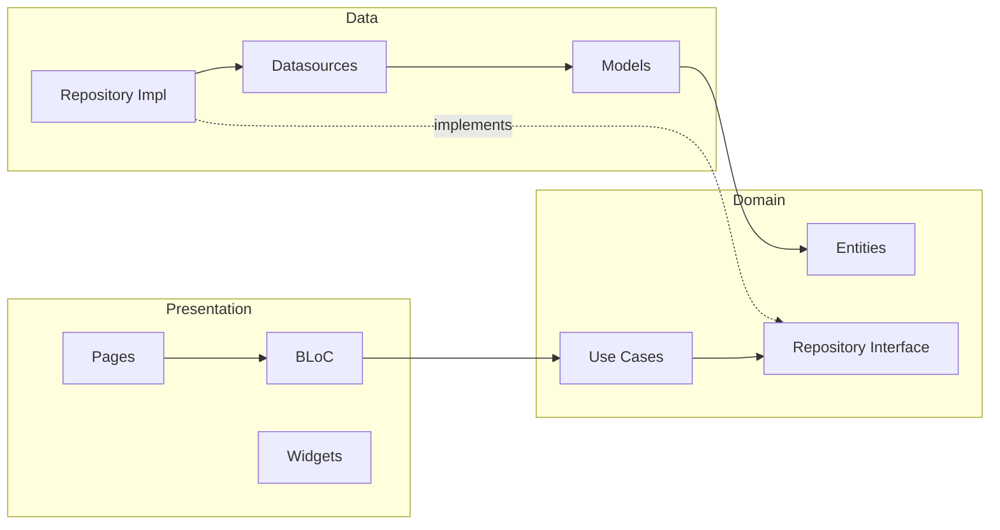

# TaxOS — Architecture

**Document ID:** DOC-03  
**Version:** 1.0  
**Last updated:** July 2026  
**Status:** Active  
**Audience:** Engineering, DevOps, technical leadership

---

## 1. Overview

TaxOS follows **Clean Architecture** with a **feature-first** folder structure. The system is a Flutter mobile client communicating with a Supabase backend. Business logic is isolated from frameworks, UI, and infrastructure to maximize testability, maintainability, and team scalability.

---

## 2. System context



---

## 3. Architectural principles

| Principle | Description |
|-----------|-------------|
| **Dependency inversion** | High-level modules (domain) do not depend on low-level modules (data). Both depend on abstractions. |
| **Single responsibility** | Each class/file has one reason to change. |
| **Feature isolation** | Features are self-contained modules. Cross-feature communication goes through domain events or shared services. |
| **Framework independence** | Domain layer is pure Dart — no Flutter, no Supabase imports. |
| **Testability** | Every use case and repository is unit-testable with mocks. |
| **Offline-first (partial)** | Expense entry and document queuing work offline; sync on reconnect. |

---

## 4. Layer architecture

### 4.1 Presentation layer

**Location:** `lib/features/<feature>/presentation/`

| Component | Responsibility |
|-----------|----------------|
| **Pages** | Full-screen route destinations; compose widgets |
| **Widgets** | Feature-specific reusable UI components |
| **BLoC / Cubit** | State management; calls use cases; emits states |

**Rules:**
- BLoC/Cubit calls use cases only — never repositories or datasources directly
- No business logic — only UI logic (formatting, navigation, loading states)
- All user-visible strings via localization (ARB files)
- Widgets are stateless where possible; state lives in BLoC

**State management:** BLoC pattern with `flutter_bloc` package.

### 4.2 Domain layer

**Location:** `lib/features/<feature>/domain/`

| Component | Responsibility |
|-----------|----------------|
| **Entities** | Core business objects (pure Dart classes) |
| **Repositories (abstract)** | Contracts defining data operations |
| **Use cases** | Single-purpose business operations |

**Rules:**
- Zero external dependencies (no Flutter, no Supabase, no HTTP)
- Entities are immutable value objects
- Use cases return `Either<Failure, Success>` for error handling
- One use case per business operation

### 4.3 Data layer

**Location:** `lib/features/<feature>/data/`

| Component | Responsibility |
|-----------|----------------|
| **Models** | DTOs with JSON serialization; extend or map to entities |
| **Datasources (abstract + impl)** | Remote (Supabase) and local (cache) data access |
| **Repositories (impl)** | Implement domain repository contracts |

**Rules:**
- Models handle serialization/deserialization
- Datasources throw exceptions; repositories catch and return Failures
- Remote datasource uses Supabase client from `lib/core/network/`
- Local datasource uses Hive or SharedPreferences for caching

---

## 5. Dependency flow



**Dependency injection:** `get_it` service locator with `injectable` code generation. Registration in `lib/app/di/`.

---

## 6. Feature module structure

Every feature under `lib/features/` follows this layout:

```
lib/features/<feature_name>/
├── data/
│   ├── datasources/
│   │   ├── <feature>_remote_datasource.dart
│   │   └── <feature>_local_datasource.dart
│   ├── models/
│   │   └── <entity>_model.dart
│   └── repositories/
│       └── <feature>_repository_impl.dart
├── domain/
│   ├── entities/
│   │   └── <entity>.dart
│   ├── repositories/
│   │   └── <feature>_repository.dart
│   └── usecases/
│       └── <action>_<entity>.dart
└── presentation/
    ├── bloc/
    │   ├── <feature>_bloc.dart
    │   ├── <feature>_event.dart
    │   └── <feature>_state.dart
    ├── pages/
    │   └── <page_name>_page.dart
    └── widgets/
        └── <widget_name>.dart
```

### 6.1 Feature list (v1)

| Feature | Domain | Key entities |
|---------|--------|--------------|
| `auth` | Authentication and session | User, Session |
| `onboarding` | First-run setup | TaxProfile, OnboardingStep |
| `dashboard` | Home overview | DashboardSummary, Deadline |
| `tax_filing` | Return preparation | TaxReturn, IncomeEntry, Deduction |
| `tax_calculator` | Tax estimation | TaxEstimate, TaxBracket |
| `documents` | Document management | Document, DocumentCategory |
| `clients` | Client CRM (future) | Client, ClientContact |
| `invoicing` | Invoice management | Invoice, LineItem |
| `expenses` | Expense tracking | Expense, ExpenseCategory |
| `reports` | Report generation | Report, ReportConfig |
| `subscriptions` | Billing and plans | Subscription, Plan |
| `notifications` | Alerts and messages | Notification, NotificationPreference |
| `settings` | App configuration | AppSettings |
| `profile` | User profile | UserProfile, Dependent |

---

## 7. Shared modules

### 7.1 `lib/app/` — Application shell

| Module | Purpose |
|--------|---------|
| `config/` | Environment variables, feature flags, app constants |
| `di/` | Dependency injection container setup |
| `router/` | GoRouter route definitions, guards, deep links |
| `theme/` | Material 3 theme, typography, color tokens |

### 7.2 `lib/core/` — Cross-cutting infrastructure

| Module | Purpose |
|--------|---------|
| `constants/` | API endpoints, storage keys, app-wide literals |
| `errors/` | Failure classes, exception types, error mapping |
| `extensions/` | Dart extensions (DateTime, String, BuildContext) |
| `network/` | Supabase client wrapper, connectivity checker |
| `storage/` | Secure storage, local cache abstractions |
| `utils/` | Formatters (currency, date), parsers |
| `validators/` | Input validation (email, tax ID, SSN format) |

### 7.3 `lib/shared/` — Cross-feature shared code

| Module | Purpose |
|--------|---------|
| `widgets/` | Design system components (buttons, inputs, cards, dialogs) |
| `models/` | Cross-feature DTOs (PaginatedResponse, ApiResult) |
| `services/` | Analytics, crash reporting, deep linking |

**Rule:** Only place code here if used by 2+ features. Otherwise keep it in the feature.

---

## 8. Navigation architecture

**Router:** `go_router` with declarative route definitions.

| Route pattern | Feature | Auth required |
|---------------|---------|---------------|
| `/login` | auth | No |
| `/register` | auth | No |
| `/onboarding` | onboarding | Yes |
| `/dashboard` | dashboard | Yes |
| `/expenses` | expenses | Yes |
| `/expenses/add` | expenses | Yes |
| `/documents` | documents | Yes |
| `/filing` | tax_filing | Yes |
| `/filing/:returnId` | tax_filing | Yes |
| `/calculator` | tax_calculator | Yes |
| `/invoices` | invoicing | Yes |
| `/reports` | reports | Yes |
| `/settings` | settings | Yes |
| `/profile` | profile | Yes |
| `/subscription` | subscriptions | Yes |

**Auth guard:** Redirect unauthenticated users to `/login`. Redirect incomplete onboarding to `/onboarding`.

---

## 9. Error handling strategy

### 9.1 Domain layer

Use cases return `Either<Failure, T>` from the `dartz` package.

| Failure type | When |
|--------------|------|
| `ServerFailure` | Supabase API error, 5xx |
| `CacheFailure` | Local storage read/write error |
| `NetworkFailure` | No connectivity |
| `ValidationFailure` | Business rule violation |
| `AuthFailure` | Session expired, unauthorized |
| `NotFoundFailure` | Resource does not exist |
| `SubscriptionFailure` | Feature gated by plan |

### 9.2 Presentation layer

BLoC maps Failures to user-friendly error states:

| Failure | User message |
|---------|-------------|
| `NetworkFailure` | "No internet connection. Changes will sync when you're back online." |
| `AuthFailure` | "Your session has expired. Please sign in again." |
| `ValidationFailure` | Specific field-level error from failure message |
| `ServerFailure` | "Something went wrong. Please try again." |
| `SubscriptionFailure` | Upsell dialog with plan comparison |

---

## 10. Data flow patterns

### 10.1 Read operation

```
Page → BLoC (event) → UseCase → Repository → RemoteDatasource → Supabase
                                                              ↓
Page ← BLoC (state) ← UseCase ← Repository ← Model → Entity
```

### 10.2 Write operation

```
Page → BLoC (event) → UseCase (validate) → Repository → RemoteDatasource → Supabase
                                                                          ↓
Page ← BLoC (state: success/error) ← UseCase ← Repository ← Model → Entity
```

### 10.3 Offline write

```
Page → BLoC → UseCase → Repository → LocalDatasource (queue)
                                   → SyncService (on reconnect) → RemoteDatasource
```

---

## 11. Backend architecture (Supabase)

| Service | Usage |
|---------|-------|
| **Auth** | Email/password, OAuth (Google, Apple), JWT sessions |
| **PostgreSQL** | All structured data with RLS |
| **Storage** | Documents, receipts, generated PDFs (private buckets) |
| **Realtime** | Notification delivery, live sync indicators |
| **Edge Functions** | PDF generation, tax calculations, webhook handlers |

See [04_DATABASE.md](04_DATABASE.md) for schema details and [07_SUPABASE_GUIDE.md](07_SUPABASE_GUIDE.md) for integration patterns.

---

## 12. Security architecture

| Layer | Mechanism |
|-------|-----------|
| Transport | TLS 1.2+ for all API calls |
| Authentication | Supabase JWT with refresh token rotation |
| Authorization | Row Level Security on every table |
| Storage | Private buckets, signed URLs with expiry |
| Client | Anon key only (never service role key) |
| Sensitive fields | SSN/TIN masked in UI; encrypted column storage |
| Session | Auto-expire after 30 days inactivity |

See [08_SECURITY.md](08_SECURITY.md) for the full security policy.

---

## 13. Testing strategy

| Layer | Test type | Tools |
|-------|-----------|-------|
| Domain | Unit tests | `test`, `mocktail` |
| Data | Unit tests with mocked datasources | `test`, `mocktail` |
| Presentation | BLoC tests | `bloc_test` |
| Presentation | Widget tests | `flutter_test` |
| End-to-end | Integration tests | `integration_test` |

**Coverage target:** 80% for domain and data layers; 60% for presentation.

---

## 14. Deployment architecture

| Environment | Supabase project | App distribution |
|-------------|-----------------|------------------|
| Local | Supabase CLI (Docker) | Flutter run (debug) |
| Staging | `taxos-staging` | TestFlight / Internal testing |
| Production | `taxos-prod` | App Store / Google Play |

---

## 15. Architecture decision records

Significant decisions are documented in `docs/adr/`:

| ADR | Decision |
|-----|----------|
| 0001 | Use ADRs for decision tracking |
| 0002 | BLoC over Riverpod for state management (planned) |
| 0003 | Supabase over Firebase for backend (planned) |
| 0004 | Feature-first over layer-first folder structure (planned) |

---

## 16. Anti-patterns to avoid

| Anti-pattern | Why | Instead |
|--------------|-----|---------|
| God BLoC | Unmaintainable, untestable | One BLoC per feature/screen |
| Repository in presentation | Breaks layer boundaries | Use cases only |
| Supabase calls in widgets | Untestable, coupled | Repository → datasource |
| Shared mutable state | Race conditions | Immutable entities, BLoC state |
| Feature importing feature | Tight coupling | Shared abstractions in domain/core |
| Business logic in models | Models are DTOs | Logic in use cases |

---

**Related documents:** [04_DATABASE.md](04_DATABASE.md) · [06_FLUTTER_GUIDE.md](06_FLUTTER_GUIDE.md) · [07_SUPABASE_GUIDE.md](07_SUPABASE_GUIDE.md) · [10_CODING_STANDARD.md](10_CODING_STANDARD.md)
