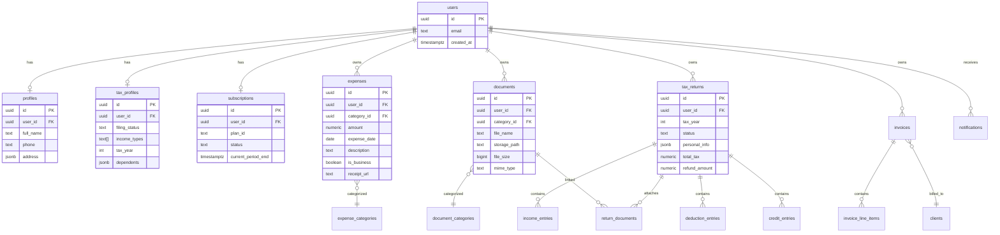

# TaxOS — Database Design

**Document ID:** DOC-04  
**Version:** 1.0  
**Last updated:** July 2026  
**Status:** Active  
**Audience:** Backend engineers, full-stack developers, DBAs

---

## 1. Overview

TaxOS uses **Supabase PostgreSQL** as its primary data store. All tables enforce **Row Level Security (RLS)** so users can only access their own data. Schema changes are managed through versioned migration files in `database/migrations/`.

---

## 2. Design principles

| Principle | Implementation |
|-----------|----------------|
| **Tenant isolation** | Every user-facing table has a `user_id` column referencing `auth.users` |
| **RLS everywhere** | No table accessible without a policy; service role bypasses for admin/Edge Functions |
| **Soft deletes** | `deleted_at` timestamp instead of hard delete for audit-sensitive data |
| **Timestamps** | Every table has `created_at` and `updated_at` with automatic triggers |
| **UUIDs** | Primary keys are UUID v4 (via `gen_random_uuid()`) |
| **Normalized** | Third normal form for relational data; JSONB for flexible/nested data |
| **Immutable migrations** | Once merged, migration files are never edited — only new migrations added |

---

## 3. Entity relationship overview

---

## 4. Table definitions

### 4.1 Authentication (managed by Supabase Auth)

Supabase Auth manages the `auth.users` table. TaxOS does not modify this table directly. All application tables reference `auth.users(id)`.

### 4.2 `profiles`

Extended user information beyond auth credentials.

| Column | Type | Constraints | Description |
|--------|------|-------------|-------------|
| `id` | `uuid` | PK, default `gen_random_uuid()` | Profile ID |
| `user_id` | `uuid` | FK → `auth.users(id)`, UNIQUE, NOT NULL | Owner |
| `full_name` | `text` | NOT NULL | Display name |
| `phone` | `text` | nullable | Phone number |
| `address` | `jsonb` | nullable | `{street, city, state, zip}` |
| `avatar_url` | `text` | nullable | Profile photo storage path |
| `created_at` | `timestamptz` | default `now()` | Creation timestamp |
| `updated_at` | `timestamptz` | default `now()` | Last update timestamp |

**RLS:** Users can SELECT, INSERT, UPDATE their own profile (`user_id = auth.uid()`).

### 4.3 `tax_profiles`

User's tax-specific configuration.

| Column | Type | Constraints | Description |
|--------|------|-------------|-------------|
| `id` | `uuid` | PK | Profile ID |
| `user_id` | `uuid` | FK → `auth.users(id)`, UNIQUE, NOT NULL | Owner |
| `filing_status` | `text` | NOT NULL | single, mfj, mfs, hoh, qw |
| `income_types` | `text[]` | default `'{}'` | w2, 1099, self_employment, investments, rental, other |
| `tax_year` | `int` | NOT NULL | Active tax year |
| `dependents` | `jsonb` | default `'[]'` | Array of `{name, relationship, ssn_last4, dob}` |
| `state_of_residence` | `text` | nullable | US state code |
| `onboarding_completed` | `boolean` | default `false` | Onboarding wizard finished |
| `created_at` | `timestamptz` | default `now()` | |
| `updated_at` | `timestamptz` | default `now()` | |

**RLS:** Users CRUD own row only.

### 4.4 `expense_categories`

Reference table for expense classification.

| Column | Type | Constraints | Description |
|--------|------|-------------|-------------|
| `id` | `uuid` | PK | Category ID |
| `name` | `text` | NOT NULL, UNIQUE | Category name |
| `slug` | `text` | NOT NULL, UNIQUE | URL-safe identifier |
| `icon` | `text` | nullable | Icon identifier |
| `is_deductible` | `boolean` | default `true` | Tax deductible by default |
| `sort_order` | `int` | default `0` | Display order |

**RLS:** All authenticated users can SELECT. Only service role can INSERT/UPDATE (seed data).

**Seed categories:** Office supplies, Travel, Meals, Utilities, Insurance, Professional services, Marketing, Equipment, Rent, Other.

### 4.5 `expenses`

| Column | Type | Constraints | Description |
|--------|------|-------------|-------------|
| `id` | `uuid` | PK | Expense ID |
| `user_id` | `uuid` | FK → `auth.users(id)`, NOT NULL | Owner |
| `category_id` | `uuid` | FK → `expense_categories(id)` | Category |
| `amount` | `numeric(12,2)` | NOT NULL, CHECK > 0 | Expense amount |
| `expense_date` | `date` | NOT NULL | Date of expense |
| `description` | `text` | nullable | User description |
| `merchant` | `text` | nullable | Vendor/merchant name |
| `is_business` | `boolean` | default `true` | Business vs. personal |
| `receipt_url` | `text` | nullable | Storage path to receipt image |
| `tax_return_id` | `uuid` | FK → `tax_returns(id)`, nullable | Linked return |
| `synced_at` | `timestamptz` | nullable | Last sync timestamp (offline) |
| `deleted_at` | `timestamptz` | nullable | Soft delete |
| `created_at` | `timestamptz` | default `now()` | |
| `updated_at` | `timestamptz` | default `now()` | |

**Indexes:** `(user_id, expense_date DESC)`, `(user_id, category_id)`, `(user_id) WHERE deleted_at IS NULL`.

**RLS:** Users CRUD own expenses only.

### 4.6 `document_categories`

| Column | Type | Constraints | Description |
|--------|------|-------------|-------------|
| `id` | `uuid` | PK | |
| `name` | `text` | NOT NULL, UNIQUE | W-2, 1099, Receipt, Invoice, Prior Return, Other |
| `slug` | `text` | NOT NULL, UNIQUE | |

**RLS:** SELECT for authenticated users. Service role for writes.

### 4.7 `documents`

| Column | Type | Constraints | Description |
|--------|------|-------------|-------------|
| `id` | `uuid` | PK | |
| `user_id` | `uuid` | FK, NOT NULL | Owner |
| `category_id` | `uuid` | FK → `document_categories(id)` | |
| `file_name` | `text` | NOT NULL | Original filename |
| `storage_path` | `text` | NOT NULL | Supabase Storage path |
| `file_size` | `bigint` | NOT NULL | Bytes |
| `mime_type` | `text` | NOT NULL | MIME type |
| `tags` | `text[]` | default `'{}'` | User tags |
| `tax_return_id` | `uuid` | FK, nullable | Linked return |
| `deleted_at` | `timestamptz` | nullable | Soft delete |
| `created_at` | `timestamptz` | default `now()` | |
| `updated_at` | `timestamptz` | default `now()` | |

**Storage bucket:** `documents` (private). Path pattern: `{user_id}/{document_id}/{filename}`.

**RLS:** Users CRUD own documents. Storage policies mirror table RLS.

### 4.8 `tax_returns`

| Column | Type | Constraints | Description |
|--------|------|-------------|-------------|
| `id` | `uuid` | PK | |
| `user_id` | `uuid` | FK, NOT NULL | Owner |
| `tax_year` | `int` | NOT NULL | |
| `status` | `text` | NOT NULL, default `'draft'` | draft, ready, submitted, accepted, rejected, amended |
| `personal_info` | `jsonb` | default `'{}'` | Name, SSN (encrypted ref), address |
| `filing_status` | `text` | NOT NULL | |
| `total_income` | `numeric(12,2)` | default `0` | |
| `total_deductions` | `numeric(12,2)` | default `0` | |
| `total_credits` | `numeric(12,2)` | default `0` | |
| `total_tax` | `numeric(12,2)` | default `0` | |
| `refund_amount` | `numeric(12,2)` | default `0` | Negative = amount owed |
| `completion_percentage` | `int` | default `0` | 0–100 |
| `submitted_at` | `timestamptz` | nullable | |
| `pdf_url` | `text` | nullable | Generated PDF storage path |
| `deleted_at` | `timestamptz` | nullable | |
| `created_at` | `timestamptz` | default `now()` | |
| `updated_at` | `timestamptz` | default `now()` | |

**Unique constraint:** `(user_id, tax_year)` WHERE `deleted_at IS NULL AND status != 'amended'`.

**RLS:** Users CRUD own returns.

### 4.9 `income_entries`

| Column | Type | Constraints | Description |
|--------|------|-------------|-------------|
| `id` | `uuid` | PK | |
| `tax_return_id` | `uuid` | FK → `tax_returns(id)`, NOT NULL | |
| `user_id` | `uuid` | FK, NOT NULL | Owner (denormalized for RLS) |
| `income_type` | `text` | NOT NULL | w2, 1099_nec, 1099_int, 1099_div, schedule_c, rental, other |
| `source_name` | `text` | nullable | Employer/payer name |
| `gross_amount` | `numeric(12,2)` | NOT NULL | |
| `federal_withheld` | `numeric(12,2)` | default `0` | |
| `state_withheld` | `numeric(12,2)` | default `0` | |
| `details` | `jsonb` | default `'{}'` | Type-specific fields |
| `created_at` | `timestamptz` | default `now()` | |
| `updated_at` | `timestamptz` | default `now()` | |

**RLS:** Users CRUD own entries (via `user_id`).

### 4.10 `deduction_entries`

| Column | Type | Constraints | Description |
|--------|------|-------------|-------------|
| `id` | `uuid` | PK | |
| `tax_return_id` | `uuid` | FK, NOT NULL | |
| `user_id` | `uuid` | FK, NOT NULL | |
| `deduction_type` | `text` | NOT NULL | standard, itemized, student_loan, hsa, ira, charitable, mortgage, medical, other |
| `amount` | `numeric(12,2)` | NOT NULL | |
| `description` | `text` | nullable | |
| `details` | `jsonb` | default `'{}'` | |
| `created_at` | `timestamptz` | default `now()` | |
| `updated_at` | `timestamptz` | default `now()` | |

**RLS:** Users CRUD own entries.

### 4.11 `subscriptions`

| Column | Type | Constraints | Description |
|--------|------|-------------|-------------|
| `id` | `uuid` | PK | |
| `user_id` | `uuid` | FK, UNIQUE, NOT NULL | One active subscription per user |
| `plan_id` | `text` | NOT NULL | free, pro, premium |
| `status` | `text` | NOT NULL | active, cancelled, past_due, trialing |
| `provider` | `text` | nullable | apple, google, stripe |
| `provider_subscription_id` | `text` | nullable | External subscription ID |
| `current_period_start` | `timestamptz` | nullable | |
| `current_period_end` | `timestamptz` | nullable | |
| `cancelled_at` | `timestamptz` | nullable | |
| `created_at` | `timestamptz` | default `now()` | |
| `updated_at` | `timestamptz` | default `now()` | |

**RLS:** Users SELECT own subscription. INSERT/UPDATE via Edge Function (webhook) with service role only.

### 4.12 `notifications`

| Column | Type | Constraints | Description |
|--------|------|-------------|-------------|
| `id` | `uuid` | PK | |
| `user_id` | `uuid` | FK, NOT NULL | |
| `type` | `text` | NOT NULL | deadline, payment, system, filing_update |
| `title` | `text` | NOT NULL | |
| `body` | `text` | NOT NULL | |
| `data` | `jsonb` | default `'{}'` | Deep link payload |
| `read_at` | `timestamptz` | nullable | |
| `created_at` | `timestamptz` | default `now()` | |

**RLS:** Users SELECT and UPDATE (mark read) own notifications. INSERT via service role (Edge Functions).

### 4.13 `invoices`

| Column | Type | Constraints | Description |
|--------|------|-------------|-------------|
| `id` | `uuid` | PK | |
| `user_id` | `uuid` | FK, NOT NULL | Issuer |
| `client_id` | `uuid` | FK → `clients(id)`, nullable | |
| `invoice_number` | `text` | NOT NULL | Auto-generated |
| `status` | `text` | NOT NULL, default `'draft'` | draft, sent, paid, overdue, cancelled |
| `issue_date` | `date` | NOT NULL | |
| `due_date` | `date` | NOT NULL | |
| `subtotal` | `numeric(12,2)` | NOT NULL | |
| `tax_amount` | `numeric(12,2)` | default `0` | |
| `total` | `numeric(12,2)` | NOT NULL | |
| `notes` | `text` | nullable | |
| `pdf_url` | `text` | nullable | |
| `paid_at` | `timestamptz` | nullable | |
| `created_at` | `timestamptz` | default `now()` | |
| `updated_at` | `timestamptz` | default `now()` | |

**RLS:** Users CRUD own invoices.

### 4.14 `clients`

| Column | Type | Constraints | Description |
|--------|------|-------------|-------------|
| `id` | `uuid` | PK | |
| `user_id` | `uuid` | FK, NOT NULL | Owner (freelancer) |
| `name` | `text` | NOT NULL | Client name |
| `email` | `text` | nullable | |
| `phone` | `text` | nullable | |
| `address` | `jsonb` | nullable | |
| `deleted_at` | `timestamptz` | nullable | |
| `created_at` | `timestamptz` | default `now()` | |
| `updated_at` | `timestamptz` | default `now()` | |

**RLS:** Users CRUD own clients.

---

## 5. Row Level Security policies

### 5.1 Standard user policy pattern

Every user-owned table follows this pattern:

| Policy | Operation | Rule |
|--------|-----------|------|
| `select_own` | SELECT | `user_id = auth.uid()` |
| `insert_own` | INSERT | `user_id = auth.uid()` |
| `update_own` | UPDATE | `user_id = auth.uid()` |
| `delete_own` | DELETE | `user_id = auth.uid()` |

### 5.2 Reference table policy

| Policy | Operation | Rule |
|--------|-----------|------|
| `select_authenticated` | SELECT | `auth.role() = 'authenticated'` |

### 5.3 Storage policies

| Bucket | Policy | Rule |
|--------|--------|------|
| `documents` | SELECT | `auth.uid()::text = (storage.foldername(name))[1]` |
| `documents` | INSERT | `auth.uid()::text = (storage.foldername(name))[1]` |
| `documents` | DELETE | `auth.uid()::text = (storage.foldername(name))[1]` |
| `receipts` | Same pattern as documents | |
| `exports` | Same pattern as documents | |

---

## 6. Database functions and triggers

| Function / Trigger | Purpose |
|--------------------|---------|
| `update_updated_at()` | Trigger function: sets `updated_at = now()` on UPDATE |
| `handle_new_user()` | Trigger on `auth.users` INSERT: creates profile and default subscription |
| `calculate_return_totals()` | Trigger on income/deduction entries: recalculates return totals |
| `check_subscription_limit()` | RPC: validates feature usage against plan limits |
| `soft_delete()` | Generic function: sets `deleted_at` instead of DELETE |

---

## 7. Migration strategy

| Rule | Detail |
|------|--------|
| Location | `database/migrations/` |
| Naming | `YYYYMMDDHHMMSS_description.sql` |
| Immutability | Never edit merged migrations |
| Rollback | Each migration includes a `-- down:` section (commented) |
| Testing | Run against local Supabase before PR |
| Production | Applied via CI/CD pipeline with approval gate |

---

## 8. Indexing strategy

| Table | Index | Purpose |
|-------|-------|---------|
| All user tables | `(user_id)` | RLS performance |
| `expenses` | `(user_id, expense_date DESC)` | Date-sorted lists |
| `expenses` | `(user_id, category_id)` | Category filtering |
| `documents` | `(user_id, category_id)` | Category filtering |
| `tax_returns` | `(user_id, tax_year)` | Return lookup |
| `notifications` | `(user_id, created_at DESC)` WHERE `read_at IS NULL` | Unread feed |
| `invoices` | `(user_id, status)` | Status filtering |

---

## 9. Data retention and deletion

| Data type | Retention | Deletion method |
|-----------|-----------|-----------------|
| Active user data | Indefinite while account active | User-initiated account deletion |
| Soft-deleted records | 90 days | Automated purge job |
| Auth sessions | 30 days inactivity | Supabase Auth auto-expire |
| Storage files | Linked to document record lifecycle | Cascade on document delete |
| Audit logs | 2 years | Automated archive |
| Account deletion | 30-day grace period | Hard delete all user data |

---

## 10. Backup and recovery

| Aspect | Configuration |
|--------|---------------|
| Automated backups | Daily (Supabase Pro plan) |
| Retention | 30 days |
| Point-in-time recovery | Enabled for production |
| Backup testing | Quarterly restore drill |
| Storage replication | Supabase managed |

---

**Related documents:** [03_ARCHITECTURE.md](03_ARCHITECTURE.md) · [07_SUPABASE_GUIDE.md](07_SUPABASE_GUIDE.md) · [08_SECURITY.md](08_SECURITY.md)
