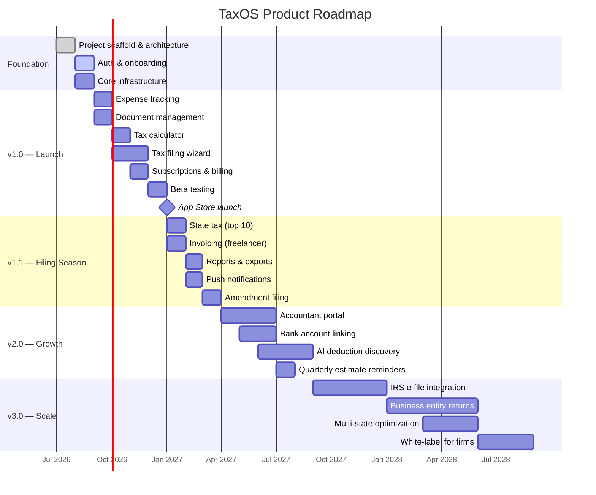

# TaxOS — Product Roadmap

**Document ID:** DOC-09  
**Version:** 1.0  
**Last updated:** July 2026  
**Status:** Active  
**Audience:** Product, engineering, leadership, stakeholders

---

## 1. Overview

This roadmap outlines the phased delivery plan for TaxOS from initial development through market expansion. Timelines are approximate and adjusted quarterly based on user feedback, market conditions, and team capacity.

---

## 2. Roadmap summary

---

## 3. Phase 0 — Foundation (Q3 2026)

**Goal:** Establish project infrastructure, architecture, and core platform.

| Deliverable | Status | Target |
|-------------|--------|--------|
| Repository scaffold (Clean Architecture) | Complete | Jul 2026 |
| Documentation suite | Complete | Jul 2026 |
| Supabase project setup (staging) | Planned | Aug 2026 |
| CI/CD pipeline (lint, test, build) | Planned | Aug 2026 |
| Authentication (email/password) | Planned | Aug 2026 |
| Onboarding wizard | Planned | Sep 2026 |
| App theme and design system | Planned | Aug 2026 |
| Navigation and routing | Planned | Sep 2026 |
| Error handling and monitoring (Sentry) | Planned | Sep 2026 |

**Exit criteria:** User can sign up, complete onboarding, and see an empty dashboard.

---

## 4. Phase 1 — v1.0 Core Product (Q3–Q4 2026)

**Goal:** Deliver the minimum viable product for beta testing before filing season.

### 4.1 Features

| Feature | Priority | Target | Dependencies |
|---------|----------|--------|-------------|
| Expense tracking (manual + camera) | P0 | Oct 2026 | Auth, storage |
| Document upload and management | P0 | Oct 2026 | Auth, storage |
| Tax calculator (federal) | P0 | Nov 2026 | Tax profile |
| Tax filing wizard (1040) | P0 | Dec 2026 | Calculator, documents |
| PDF return export | P0 | Dec 2026 | Filing wizard |
| Dashboard with overview | P0 | Nov 2026 | All features |
| Subscription billing (Free/Pro/Premium) | P0 | Dec 2026 | RevenueCat |
| User profile and settings | P0 | Nov 2026 | Auth |
| OAuth (Google, Apple) | P1 | Dec 2026 | Auth |

### 4.2 Milestones

| Milestone | Date | Criteria |
|-----------|------|----------|
| Alpha (internal) | Nov 2026 | Core flow works end-to-end |
| Closed beta | Dec 2026 | 100 beta users, feedback collection |
| Open beta | Jan 2027 | 1,000 users, crash-free > 99% |
| App Store launch | Jan 2027 | iOS and Android approved |

### 4.3 Success metrics (v1.0)

| Metric | Target |
|--------|--------|
| Beta users completing a return | > 50% |
| App Store rating | > 4.0 |
| Crash-free rate | > 99.5% |
| Sign-up to filing conversion | > 20% |

---

## 5. Phase 2 — v1.1 Filing Season (Q1 2027)

**Goal:** Enhance the product for the 2026 tax filing season (deadline April 15, 2027).

| Feature | Priority | Target |
|---------|----------|--------|
| State tax support (top 10 states) | P0 | Feb 2027 |
| Invoicing for freelancers | P1 | Feb 2027 |
| Reports (annual summary, expense report) | P1 | Mar 2027 |
| Push notifications (deadlines) | P1 | Mar 2027 |
| Amendment filing (1040-X) | P1 | Apr 2027 |
| Expense auto-categorization | P2 | Mar 2027 |
| Document OCR (W-2, 1099) | P2 | Apr 2027 |
| What-if tax scenarios | P2 | Mar 2027 |

**Success metrics:**

| Metric | Target |
|--------|--------|
| Monthly active users | 25,000 |
| Completed filings | 10,000 |
| Free → paid conversion | 15% |
| MRR | $75K |

---

## 6. Phase 3 — v2.0 Growth (Q2–Q3 2027)

**Goal:** Expand features for retention, upsell, and professional users.

| Feature | Priority | Target |
|---------|----------|--------|
| Accountant/firm portal (web) | P1 | Jul 2027 |
| Client management for firms | P1 | Jul 2027 |
| Bank account linking (Plaid) | P1 | Jun 2027 |
| AI-assisted deduction discovery | P2 | Sep 2027 |
| Quarterly estimated tax reminders | P1 | Aug 2027 |
| Multi-device sync improvements | P1 | Jun 2027 |
| Dark mode polish | P2 | Jun 2027 |
| Widget (iOS/Android home screen) | P2 | Aug 2027 |
| Referral program | P2 | Jul 2027 |

**Success metrics:**

| Metric | Target |
|--------|--------|
| Monthly active users | 75,000 |
| MRR | $200K |
| Annual renewal rate | > 55% |
| Accountant accounts | 500 |

---

## 7. Phase 4 — v3.0 Scale (Q4 2027 – Q3 2028)

**Goal:** Enterprise-grade features, e-file certification, and market expansion.

| Feature | Priority | Target |
|---------|----------|--------|
| IRS e-file integration | P0 | Q1 2028 |
| Business entity returns (1120, 1065) | P1 | Q2 2028 |
| Multi-state optimization engine | P1 | Q2 2028 |
| White-label platform for firms | P2 | Q3 2028 |
| SOC 2 Type II certification | P1 | Q2 2028 |
| International expansion (Canada) | P2 | Q3 2028 |
| API for third-party integrations | P2 | Q3 2028 |
| Advanced analytics dashboard | P2 | Q4 2027 |

**Success metrics:**

| Metric | Target |
|--------|--------|
| Monthly active users | 200,000 |
| MRR | $500K |
| E-file submissions | 50,000/season |
| Accounting firm clients | 2,000 |

---

## 8. Technical roadmap

| Initiative | Phase | Detail |
|------------|-------|--------|
| Clean Architecture scaffold | Phase 0 | Complete |
| BLoC state management | Phase 0–1 | All features |
| Supabase RLS | Phase 0–1 | All tables |
| Offline expense sync | Phase 1 | Queue-based sync |
| Edge Functions (PDF, calc) | Phase 1 | Server-side processing |
| Certificate pinning | Phase 2 | v1.1 security |
| Web app (Flutter Web or Next.js) | Phase 3 | Accountant portal |
| Microservices extraction | Phase 4 | Tax calculation engine |
| Kubernetes migration | Phase 4 | If Supabase limits reached |

---

## 9. Release cadence

| Release type | Frequency | Content |
|--------------|-----------|---------|
| Major (vX.0) | Quarterly | New features, possible breaking changes |
| Minor (vX.Y) | Monthly | Feature enhancements, new modules |
| Patch (vX.Y.Z) | As needed | Bug fixes, security patches |
| Hotfix | Emergency | Critical production issues |

---

## 10. Risk register

| Risk | Impact | Mitigation | Phase affected |
|------|--------|------------|----------------|
| Missing filing season deadline | Critical | Aggressive v1.0 timeline; MVP scope | Phase 1 |
| Tax law changes | High | Modular tax rule engine | All |
| IRS e-file certification delay | High | PDF export as fallback | Phase 4 |
| Supabase scaling limits | Medium | Monitor usage; plan migration path | Phase 3+ |
| Key person dependency | Medium | Documentation, pair programming | All |
| Competitor launch | Medium | Speed to market; mobile-first UX | Phase 1 |
| App Store rejection | Medium | Pre-submission compliance review | Phase 1 |
| Security breach | Critical | Security-first architecture | All |

---

## 11. Quarterly review process

| Activity | Timing | Participants |
|----------|--------|-------------|
| Roadmap review | First week of each quarter | Product, engineering, leadership |
| Metrics review | Monthly | Product, engineering |
| User feedback synthesis | Bi-weekly | Product, design |
| Technical debt assessment | Monthly | Engineering |
| Roadmap adjustment | As needed | Product lead approval |

---

## 12. Document history

| Version | Date | Changes |
|---------|------|---------|
| 1.0 | Jul 2026 | Initial roadmap |

---

**Related documents:** [01_PRODUCT_VISION.md](01_PRODUCT_VISION.md) · [02_PRD.md](02_PRD.md) · [12_BACKLOG.md](12_BACKLOG.md)
